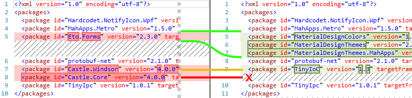

# repkg
A batch converter tool for packages.config files. It can remove unused packages or update package names and versions.

The sample mapping file with three simple entries ...

    Eto.Forms @.*?      | MaterialDesignColors @1.1.3 : MaterialDesignThemes @2.3.0.823 : MaterialDesignThemes.MahApps @0.0.10
    Castle.Windsor @.*? | TinyIoC @1.3
    Castle.Core @.*?    | 
    
    
    
    
... converts a packages.config file like this:

### Usage
Call the executable `repkg.exe` with two arguments:
 - the **path** to convert files in
 - the **mapping file** to convert files with:
 
  `repkg.exe "C:\Repositories\TargetFolder" "..\_map\sample.map"`
